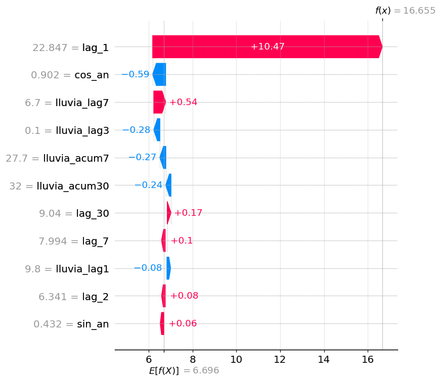
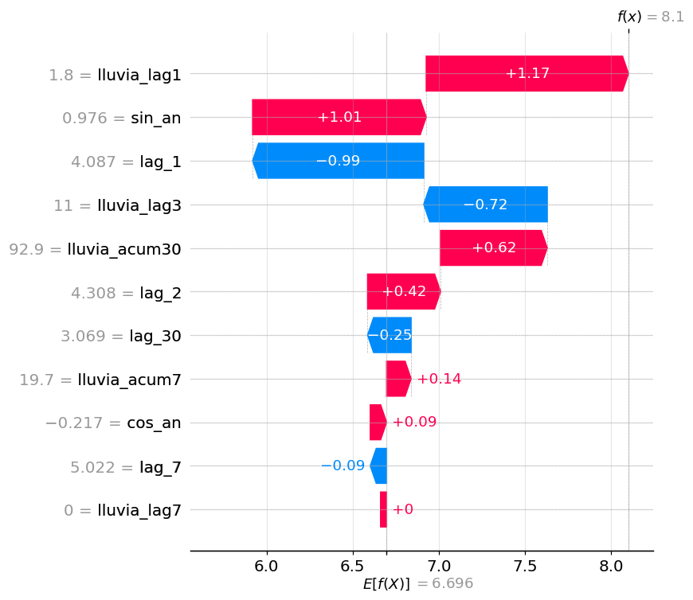
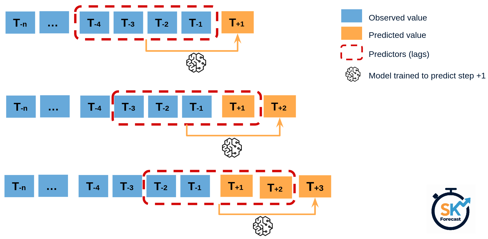
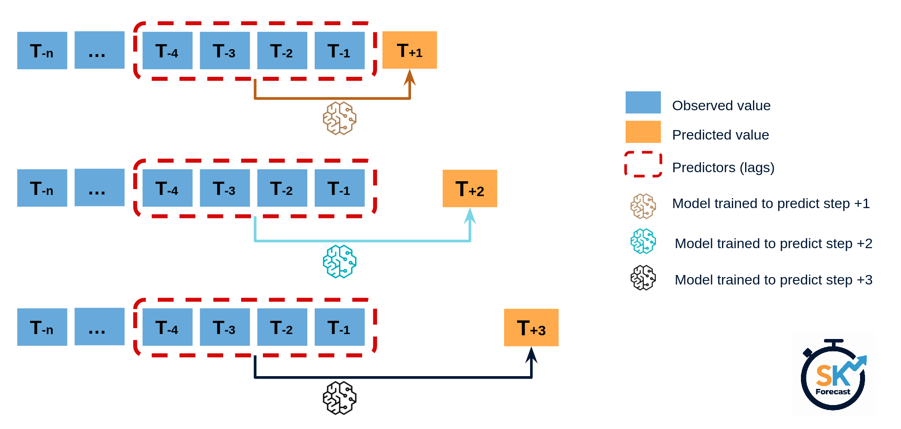
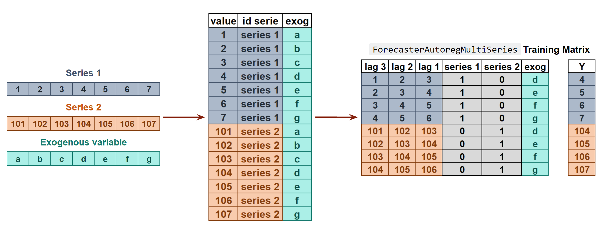

```{python}
#| label: setup-global
#| echo: false
import warnings
warnings.filterwarnings("ignore")

import numpy as np
import pandas as pd
import matplotlib.pyplot as plt

plt.rcParams.update({
    "figure.figsize": (9, 3.4),
    "axes.grid": True,
    "grid.alpha": 0.3,
    "axes.spines.top": False,
    "axes.spines.right": False,
    "font.size": 11,
})

from cst import datos as ud

CAUDAL = ud.cargar_caudal_genil().loc["1995":"2020"]
LLUVIA = ud.cargar_lluvia_genil_diaria(fecha_inicio="1995-01-01", fecha_fin="2020-12-31")
```

## Bienvenida {.section-divider}

**Hoy:** convertir series temporales en problemas supervisados, aplicar Random Forest / XGBoost / LightGBM con `scikit-learn`/`skforecast`, y evaluar calidad de los modelos.

---

## Índice

1. **De serie a supervisado** — sliding window, feature engineering — *45 min*
2. **Modelos clásicos de ML** — Ridge, RF, XGBoost, LightGBM — *45 min*
3. **Selección y evaluación** — splits, métricas genéricas e hidrológicas, SHAP/permutation — *60 min*
4. **Predicciones a futuro** — multi-paso, intervalos — *30 min*

---

## Bloque 1 · De serie a problema supervisado {.section-divider}

---

## El truco fundamental

ML clásico necesita pares $(X, y)$. Con una serie $\{y_t\}$ los construimos con una **ventana deslizante**:

| $X$ (features) | $y$ (target) |
|---|---|
| $(y_{t-1}, y_{t-2}, \ldots, y_{t-p})$ | $y_t$ |

. . .

```{python}
#| label: ventana-demo
#| echo: true
def crear_features_lag(serie, lags):
    df = pd.DataFrame({"y": serie})
    for lag in lags:
        df[f"lag_{lag}"] = serie.shift(lag)
    return df.dropna()

q = CAUDAL.dropna()
X = crear_features_lag(q, lags=[1, 2, 3, 7, 30])
print(X.head())
```

---

## Tipos de features para series temporales

**1. Autoregresivas (lags y diferencias)**

- `lag_1`, `lag_7`, `lag_30`; `diff_1 = y_t - y_{t-1}`.

**2. Estadísticos móviles (rolling)**

- `rolling_mean_7`, `rolling_std_30`, `rolling_max_90`...

**3. Calendario (cíclicas)**

- Mes, día del año, día de la semana, hora, año hidrológico.
- Codificación: **entero** o par de **Fourier** $\sin/\cos(2\pi t/s)$ → ver más adelante.

**4. Exógenas**

- Lluvia retardada, ET₀, índices climáticos (NAO).

---

## Rolling features — ejemplo

```{python}
#| label: rolling-demo
#| echo: false
q = CAUDAL.dropna()
feats = pd.DataFrame({
    "y": q,
    "media_7":  q.rolling(7).mean(),
    "max_30":   q.rolling(30).max(),
    "std_30":   q.rolling(30).std(),
}).dropna()
print(feats.tail(5).round(2))
```

. . .

```{python}
#| label: rolling-fig
#| echo: false
#| fig-cap: "Caudal vs media móvil 30 días — la suavización es la fuente del feature"
ventana = CAUDAL.loc["2019":"2020"].dropna()
fig, ax = plt.subplots()
ax.plot(ventana.index, ventana.values, color="#1f6f8b", lw=0.4, alpha=0.6, label="diario")
ax.plot(ventana.index, ventana.rolling(30).mean(), color="#c2410c", lw=1.6, label="rolling 30d")
ax.set_ylabel("Q (m³/s)"); ax.legend()
plt.tight_layout()
```

---

## Codificación cíclica (Fourier)

:::: {.columns}
::: {.column width="58%"}
**Problema:** `mes=12` (dic) y `mes=1` (ene) son **adyacentes** en el ciclo anual, pero el modelo los ve a distancia 11.

**Solución:** proyectar un ciclo de periodo $s$ sobre el círculo unidad:

$$
\sin\!\left(\tfrac{2\pi t}{s}\right), \quad \cos\!\left(\tfrac{2\pi t}{s}\right)
$$

La distancia entre dos puntos $(\sin, \cos)$ refleja la distancia **cíclica**, no la numérica.
:::

::: {.column width="42%"}
```{python}
#| label: fourier-circle
#| echo: false
m = np.arange(1, 13)
x, y = np.cos(2 * np.pi * m / 12), np.sin(2 * np.pi * m / 12)
fig, ax = plt.subplots(figsize=(3.2, 3.2))
theta = np.linspace(0, 2 * np.pi, 200)
ax.plot(np.cos(theta), np.sin(theta), color="#cbd5e1", lw=0.8)
ax.scatter(x, y, s=70, color="#1f6f8b", zorder=3)
for mi, xi, yi in zip(m, x, y):
    ax.annotate(str(mi), (xi * 1.20, yi * 1.20), ha="center", va="center", fontsize=10)
ax.set_xlim(-1.4, 1.4); ax.set_ylim(-1.4, 1.4)
ax.set_aspect("equal"); ax.axis("off")
plt.tight_layout()
```
:::
::::

---

## Codificación cíclica: ejemplos

Cualquier variable **cíclica** se codifica con su par $(\sin, \cos)$ usando el periodo $s$ apropiado:

| Feature | Periodo $s$ | Pareja de columnas |
|---|---|---|
| Hora del día | 24 | $\sin/\cos(2\pi h / 24)$ |
| Día de la semana | 7 | $\sin/\cos(2\pi d / 7)$ |
| Mes | 12 | $\sin/\cos(2\pi m / 12)$ |
| Día del año | 365.25 | $\sin/\cos(2\pi \mathrm{doy} / 365.25)$ |

. . .

Las features **no cíclicas** (año, tendencia) **no** se codifican así — sólo las que "dan la vuelta".

---

## Variables exógenas — lluvia retardada

```{python}
#| label: lluvia-lags
#| echo: true
lluvia = LLUVIA.copy()
df = pd.DataFrame({"caudal": CAUDAL, "lluvia": lluvia})
for lag in (1, 3, 7, 14, 30):
    df[f"lluvia_lag{lag}"] = df["lluvia"].shift(lag)
    df[f"lluvia_acum{lag}d"] = df["lluvia"].rolling(lag).sum().shift(1)
print(df.dropna().tail(3).round(2))
```

. . .

**Lluvia acumulada en ventana** suele ser más predictiva que la lluvia puntual del día anterior, especialmente en cuencas reguladas.

---

## Conexión con Pastas (Sesión 2)

Lo que acabamos de construir — lags de lluvia + regresión — **es** un modelo de respuesta a impulsos:

$$
\hat y_t = \beta_0 + \sum_{k=0}^{K} \beta_k \cdot R_{t-k}
$$

Los $\beta_k$ forman la IRF **empírica, no paramétrica**: un peso por lag.

. . .

|  | Pastas (TFN) | ML con lluvia retardada |
|---|---|---|
| IRF | **Paramétrica** (Gamma, ~3 params) | **No paramétrica** ($K$ pesos $\beta_k$) |
| Regularización | Prior en la forma de la IRF | Ridge / Lasso sobre $\beta_k$ |
| Muestreo irregular | Nativo (AR(1) continuo) | Requiere rejilla regular |
| No-linealidad | Solo en la convolución (lineal en estímulos) | RF / GBM la capturan |
| Datos necesarios | Pocos | Más a mayor $K$ |

---

## El pitfall clásico: fuga de información

> El feature usa **información del futuro** que no estará disponible en producción.

. . .

**Casos típicos:**

- `rolling_mean(window=7, center=True)` — ¡ve 3 días al futuro!
- Escalador `StandardScaler.fit_transform(X)` en el set completo → la media del test contamina el train.
- `df['y_smooth'] = df['y'].rolling(30).mean()` y luego usar `y_smooth` como feature.
- Observaciones en lugar de predicciones

---

## Fuga de información — regla práctica

- Rolling **siempre** con `center=False`.
- Escaladores: `fit` sólo en train, `transform` en test.
- Si dudas: imagina que estás **dentro** del día $t$ — ¿tendrías el dato?

---

## Resumen Bloque 1

- Una serie temporal se convierte en problema supervisado con **lags + rolling + calendario + exógenas**.
- La elección de features importa más que el modelo (en ML clásico).
- Cuidado con filtrar información del futuro en los datos de entrenamiento.

. . .

En el notebook 01 construirás la matriz de features para el caudal del Genil y un baseline persistencia + regresión lineal.

---

## Bloque 2 · Modelos clásicos de ML {.section-divider}

---

## Panorama

::: {.model-flow}
::: {.model-box}
**Linear**<br/>Ridge / Lasso
:::
::: {.model-arrow}
→
:::
::: {.model-box}
**Random Forest**
:::
::: {.model-arrow}
→
:::
::: {.model-box}
**XGBoost**
:::
::: {.model-arrow}
→
:::
::: {.model-stack}
::: {.model-box}
**LightGBM**
:::
::: {.model-box}
**CatBoost**
:::
:::
:::

. . .

**Filosofía común:** mismo problema supervisado $X \to y$, distintos *bias-variance tradeoffs* y velocidades.

---

## Panorama — comparativa rápida

- **Lineal regularizado**: bias alto, varianza baja, interpretable.
- **Decision Trees**: poco bias, potencialmente mucha varianza (riesgo *overfitting*), interpretables
- **Random Forest**: baja varianza vía bagging.
- **Gradient Boosting** (XGB / LGB): aprendizaje secuencial, regularización fina.

---

## Baselines (siempre)

Tres baselines que un modelo debe **batir** para ser usable:

1. **Persistencia**: $\hat y_t = y_{t-1}$.
2. **Persistencia estacional**: $\hat y_t = y_{t-s}$ (en caudal mensual, $s=12$).
3. **Climatología**: $\hat y_t = \overline{y_{\,m(t)}}$, la media histórica del mes.

. . .

```{python}
#| label: baselines
#| echo: true
caudal_m = CAUDAL.resample("MS").mean().dropna()
train = caudal_m.loc[:"2019"]
test = caudal_m.loc["2020":]

persistencia_s = caudal_m.shift(12).loc[test.index]
clim = train.groupby(train.index.month).mean().reindex(test.index.month).values

print(f"Persistencia anual MAE: {abs(test - persistencia_s).mean():.2f}")
print(f"Climatología      MAE: {abs(test.values - clim).mean():.2f}")
```

---

## Regresión lineal regularizada

$$
\min_{\beta} \sum_t (y_t - X_t^\top \beta)^2 + \alpha \|\beta\|_{1,2}
$$

- **Ridge** ($L_2$): bueno con muchas features correlacionadas (lags adyacentes).
- **Lasso** ($L_1$): selección automática, descarta features.
- **ElasticNet**: combinación.

---

## Random Forest

```python
RandomForestRegressor(n_estimators=200, max_depth=None,
                      min_samples_leaf=5, n_jobs=-1)
```

- **Bagging** de árboles + selección aleatoria de features.
- **Pros:** robusto, casi sin tuning, da feature importance.
- **Contras:** **no extrapola** (predice dentro del rango de entrenamiento).

. . .

**Pitfall hidrológico:** si entrenas con datos donde `Q_max = 200 m³/s` y luego viene una crecida de 400, RF te dará 200 (clipping implícito). XGBoost también, pero los modelos lineales sí extrapolan.

---

## Gradient Boosting — XGBoost y LightGBM

Construyen árboles **secuencialmente**, cada uno ajustando los residuos del anterior:

$$
F_m(x) = F_{m-1}(x) + \nu \cdot h_m(x)
$$

. . .

- **XGBoost** (2014): estándar de facto en ML competitivo.
- **LightGBM** (2017): histogram-based, **mucho más rápido** en datasets grandes.

---

## Gradient Boosting — hiperparámetros

```python
import lightgbm as lgb
model = lgb.LGBMRegressor(n_estimators=500, learning_rate=0.05,
                          num_leaves=31, min_child_samples=20)
```

. . .

**Hiperparámetros críticos:**

- `n_estimators` + `learning_rate` (el clásico ratio).
- `max_depth` / `num_leaves` (capacidad).
- `min_child_samples` (regularización).
- `subsample`, `colsample_bytree` (estocasticidad).

---

## skforecast — el puente al forecasting

`scikit-learn` no sabe predecir multi-paso. **`skforecast`** lo arregla:

```python
from skforecast.recursive import ForecasterRecursive
from lightgbm import LGBMRegressor

forecaster = ForecasterRecursive(
    regressor=LGBMRegressor(n_estimators=300),
    lags=[1, 2, 3, 7, 14, 30],
)
forecaster.fit(y=caudal_train, exog=lluvia_train)
preds = forecaster.predict(steps=30, exog=lluvia_test)
```

. . .

**Ventajas:**

- API uniforme para cualquier regresor sklearn-like.
- Estrategias multi-paso (recursive, direct, MIMO).
- Backtesting integrado; docs en español (cienciadedatos.net).

---

## Resumen Bloque 2

- **Ridge** como baseline serio.
- **RF y boosting** ganan cuando hay interacciones no lineales o eventos extremos.
- **`skforecast`** convierte regresores sklearn en forecasters multi-paso.

---

## Bloque 3 · Selección de modelo y evaluación {.section-divider}

---

## El error #1 — train/test aleatorio

```python
# MAL
X_train, X_test, y_train, y_test = train_test_split(X, y, shuffle=True)
```

. . .

Con datos i.i.d. es lo correcto. Con series temporales rompe **causalidad**: el modelo ve futuro durante el entrenamiento.

. . .

> Si un alumno te dice que su modelo de caudal tiene NSE = 0.95 con CV aleatorio, **comprueba siempre** que el split es temporal.

---

## Split temporal simple

```{python}
#| label: split-fig
#| fig-cap: "Train/validation/test cronológico"
fig, ax = plt.subplots(figsize=(10, 1.2))
ax.barh(0, 75, color="#1f6f8b"); ax.text(37, 0, "train", color="white", ha="center", va="center", fontsize=11, fontweight="bold")
ax.barh(0, 15, left=75, color="#c2410c"); ax.text(82, 0, "val", color="white", ha="center", va="center", fontsize=11, fontweight="bold")
ax.barh(0, 10, left=90, color="#16a34a"); ax.text(95, 0, "test", color="white", ha="center", va="center", fontsize=11, fontweight="bold")
ax.set_xlim(0, 100); ax.set_yticks([]); ax.set_xlabel("Tiempo (%)")
plt.tight_layout()
```

- **Train**: entrenamiento.
- **Val**: hiperparámetros, early stopping.
- **Test**: sólo se mira **al final**, una vez.

---

## TimeSeriesSplit y expanding window

`sklearn.model_selection.TimeSeriesSplit`:

```python
from sklearn.model_selection import TimeSeriesSplit
tscv = TimeSeriesSplit(n_splits=5, test_size=30)
for fold, (train_idx, test_idx) in enumerate(tscv.split(X)):
    ...
```

---

## TimeSeriesSplit — visualización

```{python}
#| label: tscv-fig
#| echo: false
#| fig-cap: "TimeSeriesSplit con n_splits=5 — train crece, test fijo"
fig, ax = plt.subplots(figsize=(10, 3.4))
colores = plt.cm.Blues(np.linspace(0.5, 1.0, 5))
for i in range(5):
    train_end = 40 + i * 10
    ax.barh(i, train_end, color=colores[i])
    ax.barh(i, 10, left=train_end, color="#c2410c")
ax.set_yticks(range(5)); ax.set_yticklabels([f"fold {i+1}" for i in range(5)])
ax.set_xlim(0, 100); ax.set_xlabel("Tiempo (%)")
plt.tight_layout()
```

---

## Backtesting en skforecast

```python
from skforecast.model_selection import backtesting_forecaster

metricas, predicciones = backtesting_forecaster(
    forecaster=forecaster,
    y=caudal,
    exog=lluvia,
    initial_train_size=200,
    steps=12,
    refit=True,             # reajusta el modelo en cada fold
    metric="mean_absolute_error",
)
```

. . .

**Parámetros críticos:**

- `initial_train_size`: tamaño del primer fold.
- `steps`: horizonte de cada predicción.
- `refit`: ¿reajustamos en cada fold (lento, realista) o sólo al principio (rápido, optimista)?

---

## Pitfalls del split temporal

1. **Test demasiado corto**: una racha de buen tiempo o sequía sesga la métrica. Mínimo 1-2 ciclos estacionales.
2. **Reajustar parámetros mirando el test**: incluso una vez es un sesgo de selección. Si lo haces, llámalo "test final".
3. **Lluvia futura como exógena**: en backtesting de SARIMAX/ML, ¿usas la lluvia real (información oracular) o un pronóstico realista?

---

## Métricas — ¿qué medimos?

Una vez tenemos split y predicciones $\hat y_t$ vs observados $o_t$, las **resumimos** con números:

- **Genéricas**: agregadas sobre todo el test — MAE, RMSE, MAPE, WAPE, sMAPE.
- **Hidrológicas**: diseñadas para capturar picos, estiaje y sesgo de volumen — NSE, KGE, PBIAS.

. . .

Una métrica nunca cuenta toda la historia. **Reportar al menos 2-3**, idealmente con un gráfico predicho vs observado.

---

## Métricas genéricas — absolutas y cuadráticas

$$
\mathrm{MAE} = \tfrac{1}{n} \sum_t |o_t - p_t| \quad
\mathrm{MSE} = \tfrac{1}{n} \sum_t (o_t - p_t)^2 \quad
\mathrm{RMSE} = \sqrt{\mathrm{MSE}}
$$

- **MAE**: mismas unidades que $y$, robusto a outliers (mediana del error absoluto).
- **MSE / RMSE**: penalizan **errores grandes** cuadráticamente — sensibles a picos.
- **RMSE** se reporta más que MSE por estar en las mismas unidades que $y$.

. . .

**Regla rápida:** si importan los picos → RMSE. Si quieres "promedio honesto" → MAE.

---

## Métricas genéricas — porcentuales

$$
\mathrm{MAPE} = \tfrac{100}{n} \sum_t \tfrac{|o_t - p_t|}{|o_t|} \qquad
\mathrm{WAPE} = 100 \cdot \tfrac{\sum_t |o_t - p_t|}{\sum_t |o_t|}
$$

$$
\mathrm{sMAPE} = \tfrac{100}{n} \sum_t \tfrac{|o_t - p_t|}{(|o_t| + |p_t|)/2}
$$

- **MAPE**: interpretable como "% de error". **Explota** si $o_t \approx 0$ (estiaje).
- **WAPE**: ponderado por magnitud, más estable que MAPE con ceros o valores pequeños.
- **sMAPE**: simétrico (no privilegia sobre/infraestimación), menos interpretable.

. . .

**Para caudales con estiaje severo: usar WAPE o RMSE/MAE; evitar MAPE.**

---

## Por qué métricas hidrológicas

Las genéricas son **promedios**. En hidrología nos importan también aspectos específicos:

- **Picos** (crecidas) → error en pico, NSE.
- **Estiaje** (sequía) → log-NSE, BFI.
- **Sesgo de volumen** (gestión de embalse) → PBIAS, $\beta$ de KGE.
- **Forma de la curva** (timing, recesión) → $r$ y $\alpha$ de KGE.

. . .

Las métricas hidrológicas son **descomposiciones** o **ponderaciones** específicas de las genéricas, no las sustituyen.

---

## NSE — Nash-Sutcliffe Efficiency

$$
\mathrm{NSE} = 1 - \frac{\sum_t (o_t - p_t)^2}{\sum_t (o_t - \bar{o})^2}
$$

. . .

- $1$ = perfecto.
- $0$ = igual de bueno que predecir la media.
- $< 0$ = peor que predecir la media.

. . .

Equivale a $1 - \mathrm{MSE}/\mathrm{Var}(o)$ — el **MSE relativo** a la varianza observada.

---

## NSE — rangos típicos (Moriasi et al., 2015)

| NSE | Calidad |
|---|---|
| > 0.75 | muy buena |
| 0.65 – 0.75 | buena |
| 0.50 – 0.65 | aceptable |
| < 0.50 | insuficiente |

---

## NSE — la trampa

NSE penaliza enormemente los **errores en picos** (cuadráticos) y es indulgente con el bias en estiaje.

. . .

**Ejemplo:**

- Modelo A: predice perfecto excepto un pico (200 vs 100 m³/s).
- Modelo B: predice 10% menos en todo, incluido el pico.

A tendrá NSE **peor** que B aunque conceptualmente sea mejor.

. . .

Por eso casi nadie publica solo NSE.

---

## KGE — Kling-Gupta Efficiency

$$
\mathrm{KGE} = 1 - \sqrt{(r - 1)^2 + (\alpha - 1)^2 + (\beta - 1)^2}
$$

- $r$ = correlación de Pearson(obs, sim).
- $\alpha = \sigma_p / \sigma_o$ — ratio de variabilidad.
- $\beta = \mu_p / \mu_o$ — ratio de sesgo.

---

## KGE — diagnóstico por componentes

**Ventaja:** descompone el error en **tres causas** independientes:

- KGE bajo porque $r$ es bajo → fase mal.
- $\alpha$ lejos de 1 → amplitud mal.
- $\beta$ lejos de 1 → bias volumen.

---

## Error en pico y PBIAS

**Error en pico:** $\mathrm{Err}_{pico} = \max(p) - \max(o)$

Importante en gestión de avenidas. Negativo (infraestimación) puede ser **catastrófico**.

. . .

**PBIAS** (porcentaje de sesgo):

$$
\mathrm{PBIAS} = 100 \cdot \frac{\sum_t (o_t - p_t)}{\sum_t o_t}
$$

Negativo = sobreestima. Positivo = infraestima. Crítico para balance hídrico anual.

---

## Interpretabilidad: SHAP

**Shapley Additive Explanations** — descomposición justa de la predicción en contribuciones por feature.

- Cada predicción $\hat y_i$ se descompone como $\phi_0 + \sum_j \phi_{ij}$, donde $\phi_{ij}$ es la contribución de la feature $j$ a la predicción $i$.
- Los pesos $\phi$ vienen de la **teoría de juegos** (valor de Shapley): reparto "justo" entre features cooperando.
- Resultado: una matriz `(n_samples, n_features)` que permite tanto explicaciones globales (importancia agregada) como **locales** (predicción concreta).

---

## Modelo de ejemplo — caudal del Genil

```{python}
#| label: ex-model
#| echo: true
import lightgbm as lgb

df = pd.DataFrame({"y": CAUDAL, "lluvia": LLUVIA}).dropna()
for lag in (1, 2, 7, 30):
    df[f"lag_{lag}"] = df["y"].shift(lag)
for lag in (1, 3, 7):
    df[f"lluvia_lag{lag}"] = df["lluvia"].shift(lag)
df["lluvia_acum7"]  = df["lluvia"].rolling(7).sum().shift(1)
df["lluvia_acum30"] = df["lluvia"].rolling(30).sum().shift(1)
df["sin_an"] = np.sin(2 * np.pi * df.index.dayofyear / 365.25)
df["cos_an"] = np.cos(2 * np.pi * df.index.dayofyear / 365.25)
df = df.drop(columns="lluvia").dropna()

train, test = df.loc[:"2020-01-01"], df.loc["2020-01-01":]
X_tr, y_tr = train.drop(columns="y"), train["y"]
X_te, y_te = test.drop(columns="y"),  test["y"]

model = lgb.LGBMRegressor(n_estimators=400, learning_rate=0.05,
                          num_leaves=31, min_child_samples=20, verbose=-1)
model.fit(X_tr, y_tr)
print(f"MAE test: {abs(model.predict(X_te) - y_te).mean():.2f} m³/s")
```

---

## SHAP — beeswarm del modelo

```{python}
#| label: ex-shap-beeswarm
#| echo: false
#| fig-align: center
import shap
explainer = shap.TreeExplainer(model)
shap_values = explainer(X_te)
shap.summary_plot(shap_values.values, X_te, max_display=11,
                  plot_size=(9, 4), show=False)
plt.tight_layout()
```

**Lectura:** un punto = un día del test. Color = valor de la feature (rojo alto, azul bajo). Eje x = contribución a $\hat y$. `lag_1` y `lluvia_lag1` dominan; valores altos (rojo) elevan la predicción.

---

## SHAP — explicar predicciones concretas

```{python}
#| label: shap-waterfall-export
#| echo: false
#| include: false
import os
os.makedirs("img-gen", exist_ok=True)
for day, fname in [("2020-01-26", "wf_caso1.png"), ("2020-04-13", "wf_caso2.png")]:
    plt.close("all")
    plt.figure(figsize=(6, 4.5))
    shap.plots.waterfall(shap_values[X_te.index.get_loc(day)], max_display=11, show=False)
    plt.tight_layout()
    plt.savefig(f"img-gen/{fname}", dpi=110, bbox_inches="tight")
    plt.close("all")
```

:::: {.columns}
::: {.column width="50%"}
**Caso 1 — 26 ene 2020**: día tras el pico de crecida ($y_{t-1}=22.85$).

{.nostretch fig-align="center" width="100%"}
:::
::: {.column width="50%"}
**Caso 2 — 13 abr 2020**: primavera, sin pico reciente.

{.nostretch fig-align="center" width="100%"}
:::
::::

---

## SHAP — leyendo los waterfalls

- **$E[f(X)] = 6.7$ m³/s** es la predicción media del modelo (baseline). Cada feature mueve la predicción $\pm$ su valor SHAP hasta el $f(x)$ final.

. . .

- **Caso 1 (inercia):** `lag_1=22.85` aporta **+10.47** él solo; el resto $<1$. El modelo arrastra el pico de ayer → $\hat y = 16.66$.
- **Caso 2 (varias señales):** sin pico reciente, **6 features** se reparten el efecto: lluvia (+1.17), estacionalidad de primavera (+1.01), lag_1 bajo (−0.99)... → $\hat y = 8.1$.

. . .

> Útil para auditar predicciones individuales: cuando el cliente pregunta "¿por qué predices crecida mañana?", el waterfall responde feature a feature.

---

## SHAP — para qué sirve

**Útil para:**

- Validar que el modelo "piensa" lo que esperamos (lag-1, lluvia reciente → caudal alto).
- Detectar features inútiles o tramposas.
- Explicar **predicciones individuales** (waterfall, force plots) a clientes técnicos no-ML.

. . .

> SHAP funciona en TODO modelo (`KernelExplainer` es lento pero universal), pero es **especialmente eficiente** en modelos de árbol (`TreeExplainer`).

---

## Permutation importance

Idea: **barajar los valores de una feature** entre observaciones y medir cuánto **empeora** la métrica del modelo. Si empeora mucho → la feature aportaba; si no cambia → es prescindible.

```{python}
#| label: ex-perm
#| echo: true
from sklearn.inspection import permutation_importance
pi = permutation_importance(
    model, X_te, y_te, n_repeats=10, random_state=0,
    scoring="neg_mean_absolute_error",
)
```

- **Agnóstico al modelo** (no usa la estructura interna).
- Calculado sobre el **test**, así que mide impacto en **generalización**, no en ajuste.
- Sesgo conocido: features **correlacionadas** se reparten la importancia y todas parecen poco útiles.

---

## Permutation importance — resultado

```{python}
#| label: ex-perm-fig
#| echo: false
#| fig-cap: "Caída de MAE al barajar cada feature (10 repeticiones) — caudal del Genil 2020"
order = pi.importances_mean.argsort()
fig, ax = plt.subplots(figsize=(7.5, 3.6))
ax.boxplot(pi.importances[order].T, vert=False, labels=X_tr.columns[order])
ax.set_xlabel("Δ MAE al barajar (mayor = más importante)")
ax.axvline(0, color="grey", lw=0.6)
plt.tight_layout()
```

. . .

**SHAP vs permutation:** el ranking suele coincidir en lo importante, pero discrepan en colas. SHAP es **más informativo** (signo y magnitud por observación); permutation es **más rápido de interpretar** para un decisor (una métrica, un número).

---

## Resumen Bloque 3

- **Split temporal** + backtesting: nunca romper causalidad; evaluar sobre varias ventanas.
- **Métricas genéricas** (MAE/RMSE/WAPE) + **hidrológicas** (NSE/KGE/PBIAS/error pico) — reportar varias, nunca una sola.
- **SHAP** y **permutation importance** auditan el modelo más allá del número agregado.
- Cuidado con: test corto, MAPE en series con ceros, NSE como única métrica.

---

## Bloque 4 · Predicciones a futuro {.section-divider}

---

## El problema

Hasta ahora: predecir $y_{t+1}$ dado el pasado. Pero a menudo queremos $y_{t+1}, y_{t+2}, \ldots, y_{t+h}$.

**¿Cómo?** Cuatro estrategias clásicas, cada una con sus pros y contras.

---

## Estrategia 1 — Recursiva

{.nostretch fig-align="center" width="72%"}

. . .

- **Un solo modelo** de 1 paso aplicado $h$ veces, alimentado con su propia predicción.
- **Pros:** un único modelo. **Contras:** acumulación de error.
- skforecast: `ForecasterRecursive` (default).

---

## Estrategia 2 — Directa

{.nostretch fig-align="center" width="68%"}

- **$h$ modelos independientes**, uno por horizonte.
- **Pros:** no propaga error. **Contras:** $h$ veces más cómputo; predicciones independientes (no suaves entre horizontes).
- skforecast: `ForecasterDirect` (`n_jobs` paraleliza el entrenamiento).

---

## Estrategias 3 y 4 — DirRec y MIMO

**DirRec (Direct-Recursive):** un modelo por horizonte (como Direct), pero cada uno recibe **las predicciones de los modelos anteriores** como features adicionales. Híbrido entre direct y recursive.

. . .

**MIMO (Multiple-Input Multiple-Output):** un modelo que predice **todo el vector** $(\hat y_{t+1}, \ldots, \hat y_{t+h})$ a la vez.

- Captura dependencias entre horizontes y produce trayectorias coherentes.
- Pide modelos con multi-output nativo: `MultiOutputRegressor`, redes neuronales (LSTM, GRU).
- En skforecast: `ForecasterRnn` para deep learning.

. . .

> DirRec **no está implementado en skforecast** — habría que montarlo a mano o usar otra librería.

---

## Comparativa de estrategias

| Estrategia | #modelos | Error acumulado | Coste cómputo | Cuándo elegir |
|---|---|---|---|---|
| Recursive | 1 | Sí | Bajo | $h$ corto, pocos datos |
| Direct | $h$ | No | Alto | $h$ medio (3–30) |
| DirRec | $h$ | Bajo | Alto | $h$ medio, no-linealidad |
| MIMO | 1 | No | Medio | $h$ grande, dependencias entre horizontes |

. . .

**En skforecast:** `ForecasterRecursive`, `ForecasterDirect`, `ForecasterRnn`.

---

## ¿Toda estrategia vale con todo modelo?

No. La estrategia depende de qué **espera el modelo como salida**:

| Modelo | Recursive | Direct | DirRec | MIMO |
|---|:---:|:---:|:---:|:---:|
| ARIMA / SARIMAX | ✓ | ✗ | ✗ | ✗ |
| ETS / Theta | ✓ | ✗ | ✗ | ✗ |
| Ridge / Lasso | ✓ | ✓ | ✓ | con `MultiOutputRegressor` |
| RF / XGB / LGBM | ✓ | ✓ | ✓ | con `MultiOutputRegressor` |
| LSTM / GRU / Transformer | ✓ | ✓ | ✓ | ✓ (nativo) |

. . .

Los **estadísticos clásicos** (ARIMA, ETS) están casados con la estrategia recursiva: su formulación matemática **es** la que produce las predicciones. Aplicar "directa" sobre un ARIMA rompe la interpretación del modelo. Los modelos **ML** son agnósticos al horizonte — el target lo defines tú.

---

## Series múltiples — global forecaster

{.nostretch fig-align="center" width="62%"}

- Un único modelo entrenado sobre **muchas series apiladas** que comparten dinámica.
- Cada fila: lags de una serie + columnas que **identifican qué serie es**.
- skforecast: `ForecasterRecursiveMultiSeries` o `ForecasterDirectMultiVariate`.

---

## Series múltiples — pros, contras y casos

- **Pros:** más datos → mejor generalización; un único modelo a mantener; series nuevas se predicen sin reentrenar.
- **Contras:** asume **dinámica compartida**; series muy heterogéneas → peor que un modelo por serie.

. . .

**Casos típicos:**

- Red de pozos en una misma cuenca.
- Estaciones de caudal vecinas que comparten régimen.
- Demanda en varias tiendas con perfil similar.
- Sensores IoT del mismo tipo (mismo equipo, distintas ubicaciones).

---

## Predicción probabilística

En vez de un valor puntual, predecir **distribución**:

- **Quantile regression**: predice $q_{0.05}, q_{0.5}, q_{0.95}$.
- **Conformal prediction**: intervalos con cobertura garantizada.
- **Distribucional**: parámetros de una distribución asumida.

. . .

```python
from skforecast.model_selection import ConformalIntervalForecaster
ci_forecaster = ConformalIntervalForecaster(forecaster, alpha=0.1)
ci_forecaster.fit(y_train, exog=X_train)
intervals = ci_forecaster.predict(steps=10, exog=X_test)
```

. . .

> En sesión 4 cerramos con un breve recordatorio. Más a fondo: cursos de UQ.

---

## Resumen Bloque 4

- Horizonte corto, pocos datos → **recursive**; horizonte medio → **direct** o **DirRec**.
- Para producción: combinar predicción puntual con **intervalos** (conformal prediction en `skforecast`) — cobertura sin asumir distribución.

---

## Mapa final {.section-divider}

---

## Cuándo usar qué (sesión 2 vs 3 vs 4)

| Tienes... | Usa |
|---|---|
| Pocos años, estacionalidad clara, sin covariables | ETS / SARIMA (S2) |
| Muchos años + covariables (lluvia) + interés en picos | RF / XGBoost / LightGBM (S3) |
| Pozos irregulares + lluvia | Pastas (S2) |
| Cuenca compleja, mucha info, foco en picos | LSTM / DL (S4) |
| Necesitas explicación al cliente | SHAP — siempre |

---

## Próximos pasos

**Práctica (1h 30min):**

1. `01_features_y_baseline.ipynb` — construir matriz de features + baseline lineal.
2. `02_rf_y_xgboost.ipynb` — RF + XGBoost + SHAP.
3. `03_backtesting_y_metricas.ipynb` — walk-forward + NSE/KGE/error pico.

. . .

Mañana: **Deep Learning** sobre los mismos datos.

## ¡Gracias! {.section-divider}

Dudas y debate
